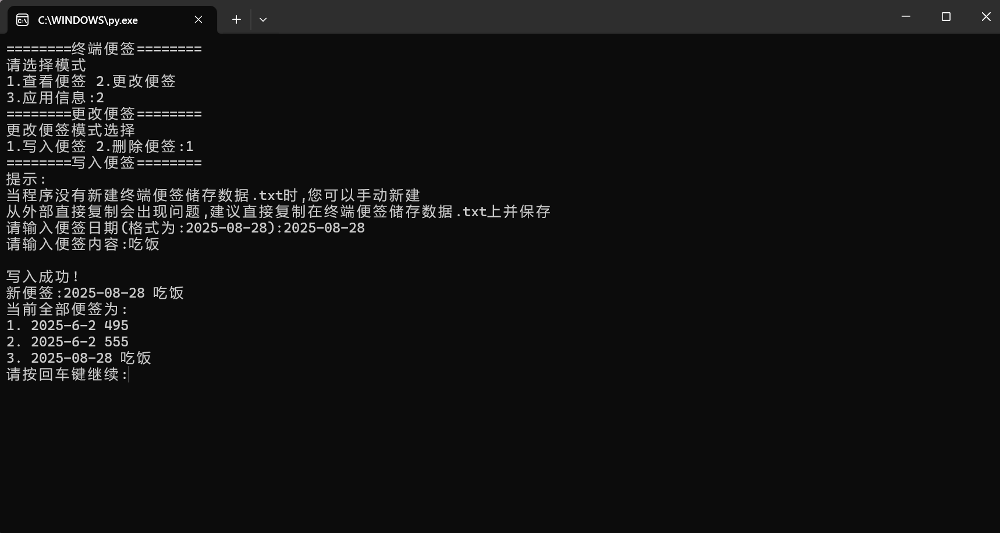
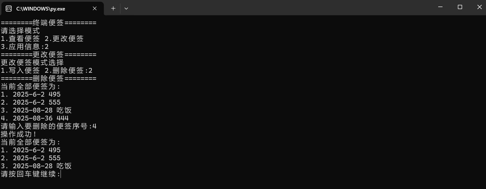
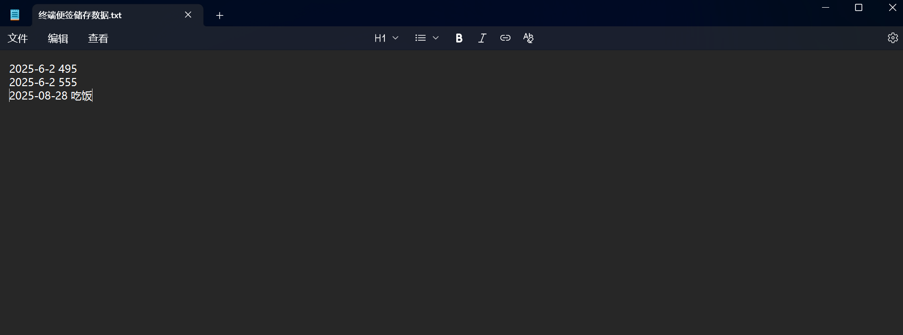

# 终端便签（Terminal Notes）
一款基于 Python 开发的轻量终端便签工具，专为习惯命令行操作的用户设计。无需切换图形界面，即可快速记录、查询、编辑和删除便签，是我作为 Python 新手独立完成的第一个实用项目。

## 项目核心信息

**项目开发背景**
学习 Python 基础语法（变量、函数、条件判断、文件操作）后，我希望通过一个实际项目巩固知识，同时解决自己“记临时信息需要切出终端”的小痛点。最终选择开发这款终端便签，全程仅使用 Python 标准库（无第三方依赖），代码逻辑简单，适合新手参考学习。

**技术特点**
仅使用 Python 标准库，无任何第三方依赖；数据存储在 `终端便签储存数据.txt ` 中，无需复杂配置，记事本即可打开查看。

### 核心功能
1. **多方式查询便签**：可查看所有便签（按创建时间排序），或按关键词搜索（匹配便签内容/标签），结果实时在终端展示。

2. **精准管理便签**：通过便签序号编辑、删除指定内容，操作后有明确的成功/失败提示，避免误操作。

3. **TXT 本地存储**：数据保存在项目目录的 `终端便签储存数据.txt` 中，不联网、不上传，数据安全且易备份。(注:如果没有可以在工具的同一个目录下自己新建一个名为"终端便签储存数据.txt"的文件)

## 前置环境要求
**Python 版本**：3.7 及以上（检查命令：`python --version` 或 `python3 --version`，显示版本号即正常）。
**终端环境**：Windows（cmd/PowerShell）、Linux（任意终端）均可。

## 免责声明

本工具为个人学习开发的开源项目，仅用于日常便签记录。开发者不承担因数据丢失、功能异常导致的任何责任，使用前建议仔细阅读代码逻辑并做好数据备份。